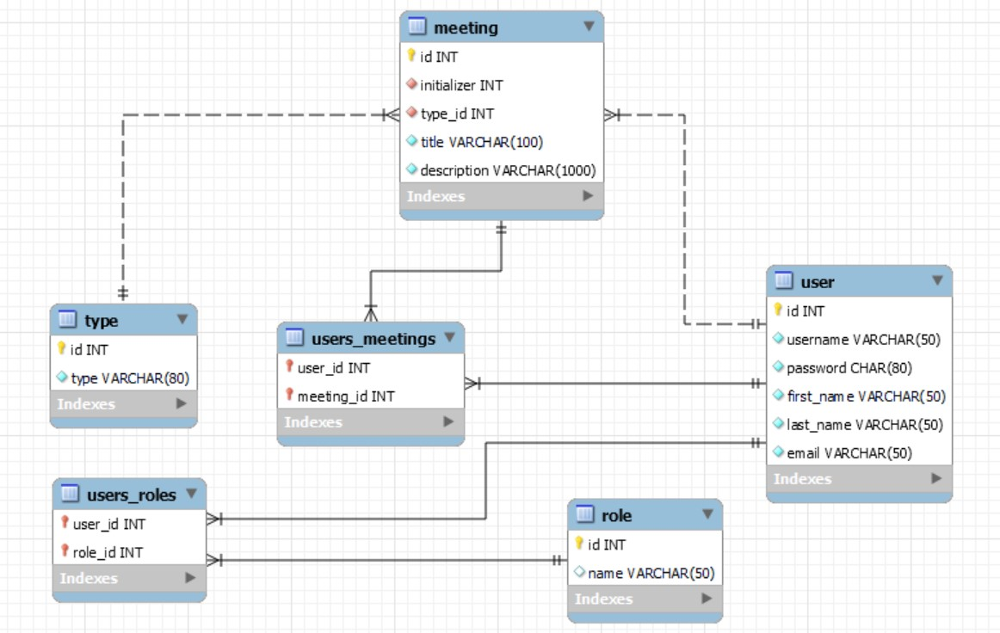

# User Event Scheduler Web App
## Overview
This is a web app that enables users to create personal events and meetings with other users.
## Database

## Frameworks
For this project, I made use of the spring framework and hibernate. JSP and Spring MVC are used to build the front end and the back end controller of the app. Hibernate is used to create the DAO that communicate the databases (set up with MySQL) and the app interface. To implement the user account system, including registration, login, logout, and reset password functionalities, we used the Spring Security framework. 
## Structure
